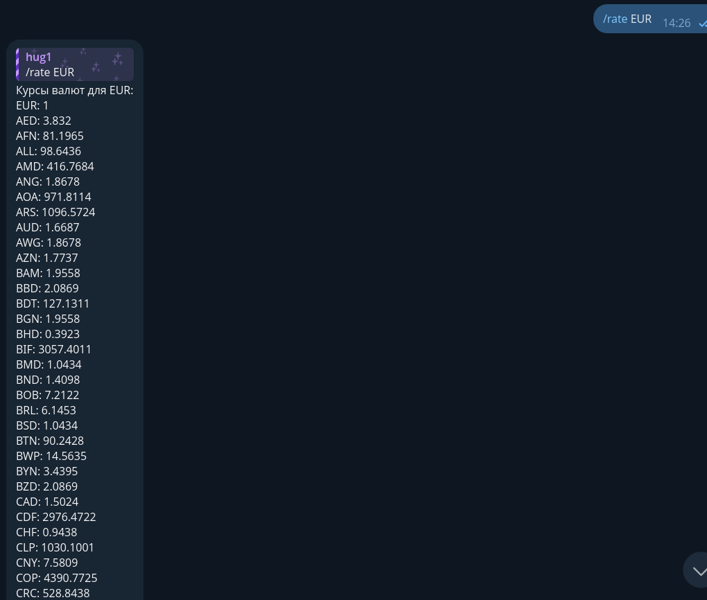
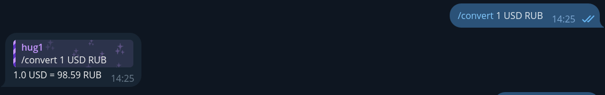

# CurrencyConverterBot
Простой бот для конвертации валют с использованием API ExchangeRate.

# Как использовать?
Сначала, вам надо установить Python и зависимости бота.
Позже - создать самого бота у BotFather и получить API-ключ на [ExchangeRate API](https://www.exchangerate-api.com/).

# Скачиваем CurrencyConverterBot:
``` shell
git clone https://github.com/nnqnn/CurrencyConverterBot
```
# Вам надо быть в `CurrencyConverterBot` для дальнейшей работы:
``` shell
cd CurrencyConverterBot
```

# Устанавливаем зависимости

**Допустим, вы уже установили python3**

Далее:

``` shell
pip install pip --upgrade
pip install -r requirements.txt
```

После этого вы должны заполнить `config.py`, добавив ваш `BOT_TOKEN` и `API_KEY`.
<br>После заполнения читайте следующую главу.

# Запускаем
```shell
python main.py
```
# Картинки-примеры
<table>
  <tr>
    <td>Ответ бота на запрос курса валют</td>
    <td></td>
  </tr>
  <tr>
    <td>Ответ бота на запрос конвертации</td>
    <td></td>
  </tr>
</table>

